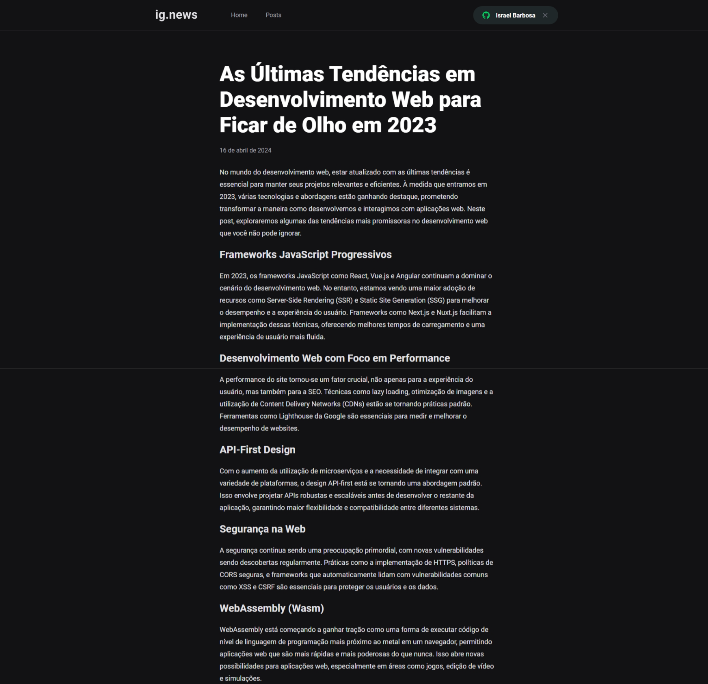

# Ignews

Ignews é um blog moderno e exclusivo, projetado para entusiastas de tecnologia e desenvolvimento que desejam se manter atualizados com as últimas tendências e insights do setor. O acesso aos conteúdos do blog é exclusivo para usuários que se cadastram utilizando suas contas do GitHub e optam pelo plano de assinatura mensal.

## Rodando localmente

Clone o projeto

```bash
  git clone https://github.com/IsraelBarbosa/ignews
```

Entre no diretório do projeto

```bash
  cd ignews
```

Instale as dependências

```bash
  yarn
```

Inicie o servidor

```bash
  yarn dev
```


## Stack utilizada

* React
* Next
* TypeScript
* Sass
* FaunaDB
* Stripe


## Aprendizados

* React: é uma biblioteca JavaScript popular para construir interfaces de usuário, especialmente para aplicações de página única. 

* TypeScript é um superconjunto de JavaScript que adiciona tipos estáticos.

* NextJS: Next.js é um framework React que permite funcionalidades como renderização do lado do servidor e geração de sites estáticos para aplicações baseadas em React.

* Prismic é um CMS headless que permite gerenciar o conteúdo e disponibilizá-lo através de uma API RESTful ou GraphQL.

* Stripe é uma ferramenta poderosa para lidar com pagamentos online. Integrar a API do Stripe permite processar pagamentos em aplicações de forma segura e eficiente.

* Sass para estilização: Sass (Syntactically Awesome Style Sheets) é uma linguagem de script de pré-processamento que é interpretada ou compilada em Cascading Style Sheets (CSS). 


## Funcionalidades

O projeto oferece as seguintes funcionalidades:

- Autenticação via GitHub: Acesse facilmente usando sua conta do GitHub, garantindo uma experiência de usuário segura e conveniente.
- Assinatura Mensal: Por apenas $9.90 ao mês, os assinantes têm acesso ilimitado a todos os posts.
- Conteúdo Exclusivo: Nossos posts são cuidadosamente elaborados por especialistas em tecnologia, oferecendo análises profundas e informações valiosas sobre as últimas novidades do mundo tech.


## Screenshots


